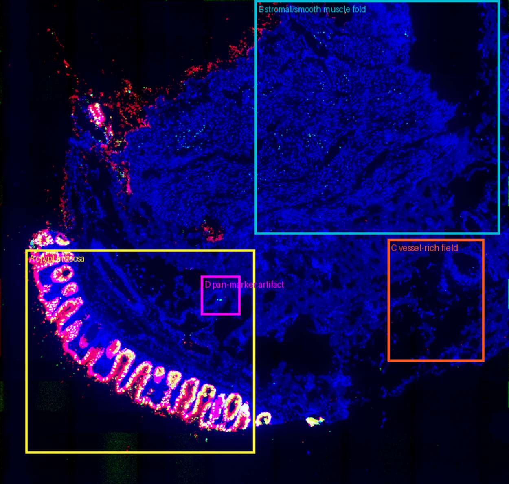
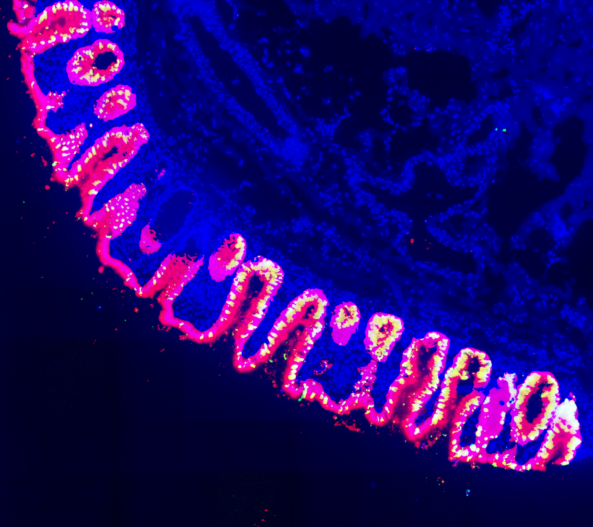
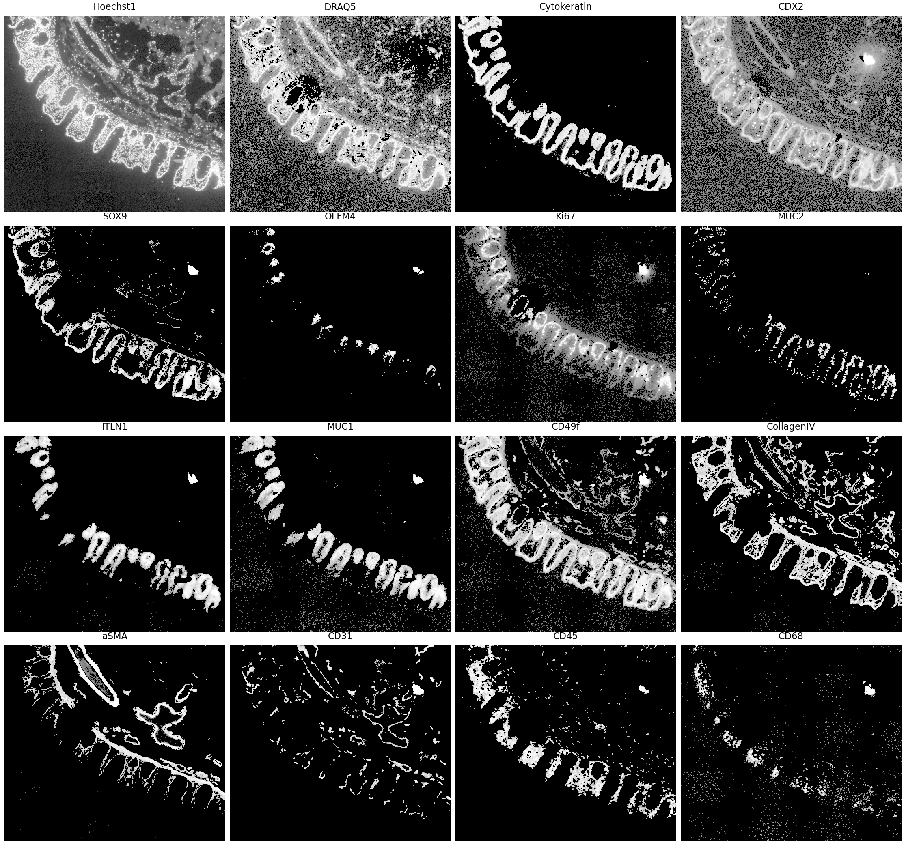
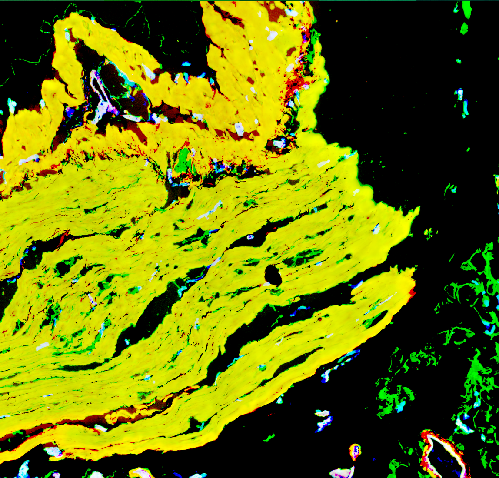
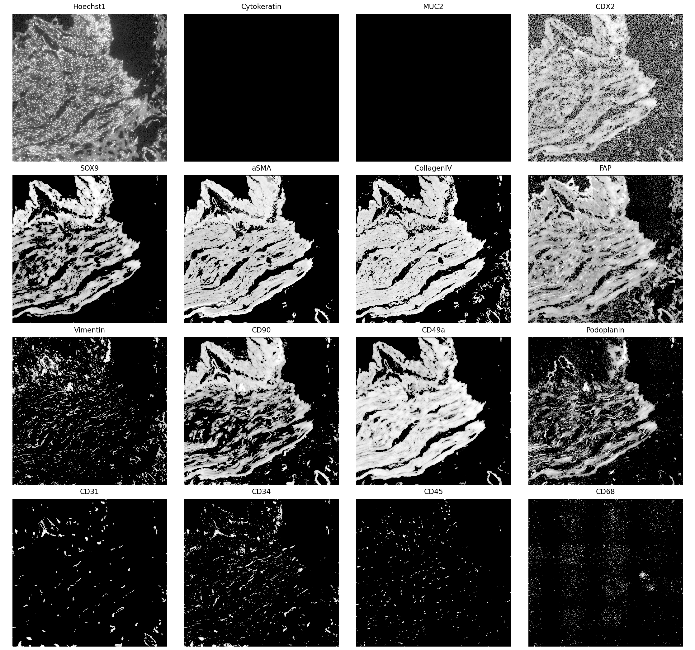
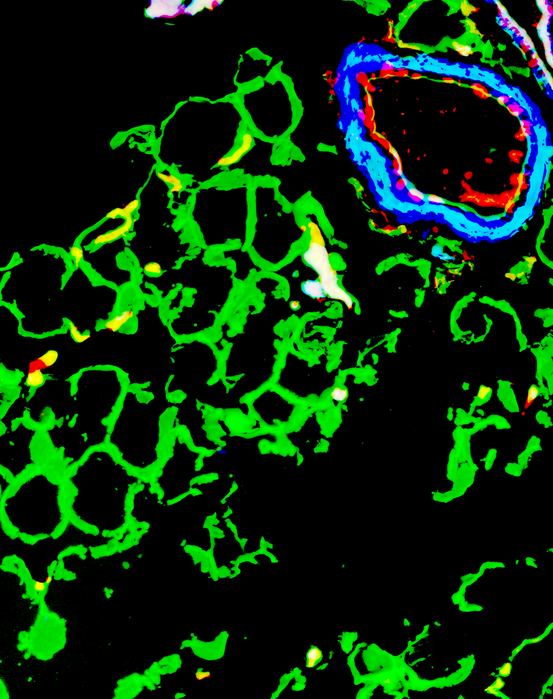
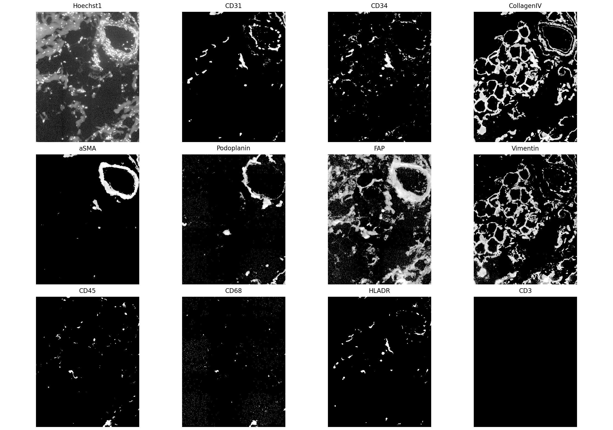
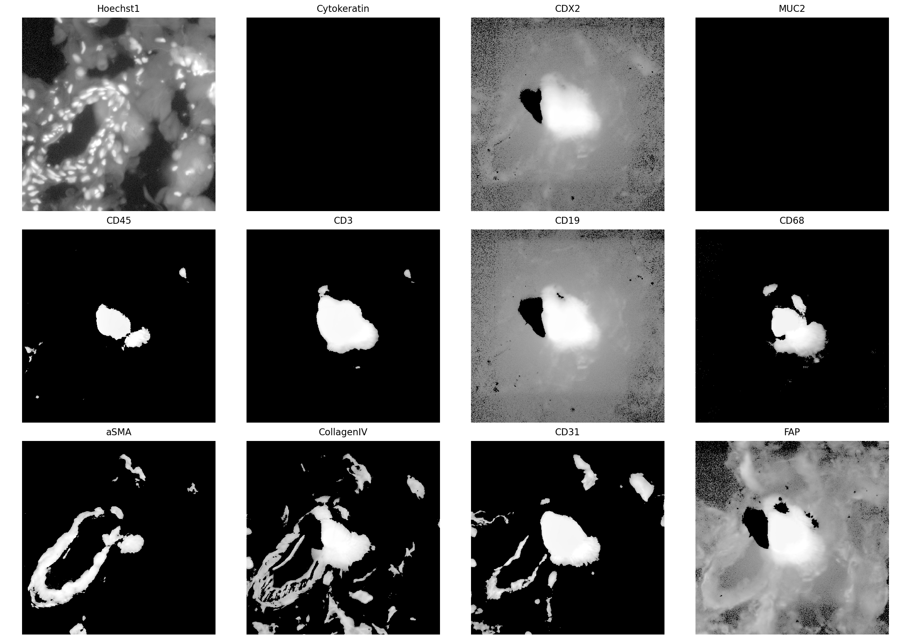

# Биологическая интерпретация HuBMAP CODEX-датасета HBM792.FFJT.499

Дата анализа: 2026-06-12  
Датасет: https://portal.hubmapconsortium.org/browse/dataset/a0946b9a99b0940c5e9eb7587deafee5  
Локальный OME-TIFF: `data/reg001_expr.ome.tif`  
Локальные каналы: `data/channels/*.tif`

## Короткий вывод

Это срез сигмовидной части толстого кишечника, полученный CODEX-мультиплексной белковой визуализацией. Поле зрения содержит минимум три крупных биологических компартмента:

1. Нижне-левая складчатая структура - слизистая толстой кишки с криптами. Это поддерживается геометрией трубчатых/овальных крипт и совместным сигналом `Cytokeratin`, `CDX2`, `SOX9`, `MUC2`, `ITLN1`, `MUC1`, `CD49f`, `CollagenIV`, `Ki67` и иммунных маркеров lamina propria.
2. Верхне-правая крупная складчатая структура - плотный стромально-гладкомышечный/ECM-фрагмент, вероятнее muscularis mucosae, muscularis propria или стромально-мышечная складка/фрагмент стенки кишки. Это не криптовый эпителий: `Cytokeratin` и `MUC2` почти отсутствуют, тогда как `aSMA`, `CollagenIV`, `FAP`, `CD90`, `CD49a`, `Podoplanin`, `Vimentin` сильные.
3. Мелкие круговые/эллипсоидные структуры в строме - сосудистые и частично лимфатико-стромальные элементы. Классическая сосудистая логика: `CD31/CD34` дают эндотелиальные контуры, `CollagenIV` даёт базальную мембрану, `aSMA` даёт муральный/гладкомышечный слой вокруг более крупных сосудов, `Podoplanin` помогает выделять лимфатический/фибробластический компонент.

Есть важные технические артефакты: сетка тайлов/фон в части каналов и pan-marker spots, где одновременно яркие десятки взаимоисключающих маркеров. Их нельзя интерпретировать как клетки.

## Метаданные и внешний контекст

Из HuBMAP Entity API и локально сохранённых JSON:

- Dataset UUID: `a0946b9a99b0940c5e9eb7587deafee5`
- HuBMAP ID: `HBM792.FFJT.499`
- DOI: https://doi.org/10.35079/HBM792.FFJT.499
- Title: `CODEX data from the large intestine of a 37-year-old white male`
- Assay: CODEX, targeted protein imaging
- Source: sample `B008-A-101`, donor `B008 / W165`
- Anatomical source: sigmoid large intestine; parent organ code `LI`
- Donor metadata: male, White, 37 years, BMI 29.3, history of hypertension, cause of death cerebrovascular accident
- Instrument/resolution: Keyence BZ-X710, x/y resolution about 377 nm, z about 1.5 um
- Panel: HuBMAP metadata lists 52 antibodies; with Hoechst/DRAQ5 nuclear stains the local image has 54 channels

Publication context: Hickey et al., Nature 2023, "Organization of the human intestine at single-cell resolution" used CODEX across eight intestinal regions and states that the expanded 54-antibody panel enabled spatial identification of intestinal cell types and neighbourhoods. The same paper is directly relevant here because this dataset is from the Stanford/HuBMAP intestine CODEX programme. It also reports that colon samples contain epithelial, stromal and immune compartments; that colon has goblet/secretory and CD66+ enterocytes, no dominant Paneth-cell compartment; and that stromal neighbourhoods include vasculature, innervated stroma and smooth muscle.

Important local naming note: local channel `06_NKG2G.tif` corresponds in HuBMAP antibody metadata to `Anti-NKG2D (CD314)`, not to a standard marker named NKG2G. I therefore interpret it as `NKG2D/CD314/KLRK1`.

## Как повторить визуальный анализ

Фигуры сгенерированы скриптом `biological_interpretation/generate_assets.py`.

Преобразование интенсивности для отображения:

- per-channel `log1p` intensity
- percentile display range approximately `1%` to `99.7%`
- gamma `0.75`
- crop coordinates are original image pixels as `x0:x1, y0:y1`
- pixel size is about `0.377 um/px`

Ключевые ROI:

- ROI A lower-left crypt mucosa: `x=500:5000, y=4900:8900`
- ROI B upper-right stromal/smooth-muscle fold: `x=5000:9800, y=0:4600`
- ROI C vessel-rich field: `x=7600:9500, y=4700:7100`
- ROI D pan-marker artifact: `x=3946:4714, y=5420:6188`

Глобальная ориентация:

Глобальные композиты:

## ROI A: нижне-левая структура - слизистая с криптами

Основной вид:

Панели маркеров:

Последовательная интерпретация:

1. Включаем `Hoechst1` и `DRAQ5`. Видим плотные ряды ядер, организованные вокруг овальных и вытянутых просветов. Такая геометрия характерна для крипт толстой кишки: трубчатые железы могут попадать в срез продольно, косо или поперечно, поэтому выглядят как складки, петли и эллипсы.
2. Включаем `Cytokeratin`. Сигнал резко выделяет внешний и внутренний эпителиальный каркас этих складок. Это главный аргумент, что структура эпителиальная, а не сосудистая или мышечная.
3. Включаем `CDX2` и `SOX9`. `CDX2` поддерживает кишечную эпителиальную идентичность, `SOX9` усиливает криптово-прогениторный компонент. В этой ROI оба маркера повторяют криптовую геометрию, а не случайно разбросаны по строме.
4. Включаем `MUC2`, `ITLN1`, `MUC1`. `MUC2` и `ITLN1` дают пятнистые/секреторные зоны внутри эпителиальных крипт, что соответствует goblet/secretory клеткам. `MUC1` подчёркивает апикально-люминальные поверхности и отличается от `MUC2`, поэтому видны как минимум разные эпителиальные субкомпартменты: общий эпителий, муцин-секретирующие клетки и апикально/люминально ориентированная мембранная зона.
5. Включаем `OLFM4` и `Ki67`. `OLFM4` пятнистый и локализован не по всей длине складок, что согласуется с crypt-base/stem-progenitor-like сигналом. `Ki67` поддерживает пролиферативные зоны в криптах.
6. Включаем `CD49f` и `CollagenIV`. Они очерчивают базальную сторону эпителия и basement membrane вокруг крипт. Это объясняет наблюдение, что одни маркеры подсвечивают границу складчатой структуры, а другие - внутреннюю/люминальную поверхность.
7. Включаем `aSMA`, `CD31`, `CD34`. Снаружи и между криптами появляются гладкомышечные/перицитарные и сосудистые элементы lamina propria/muscularis mucosae. Это не основной эпителиальный каркас, а окружающая поддерживающая ткань.
8. Включаем `CD45`, `CD3`, `CD4`, `CD8`, `CD19`, `CD138`, `CD68`, `CD163`, `CD206`, `HLA-DR`. Вокруг и между криптами видны иммунные клетки lamina propria: T-клетки, B/plasma-клетки и макрофаги/APC. Это ожидаемо для слизистой кишечника.

Поддержка по single-cell quantification:

- ROI A contains `7298` QC cells.
- Broad cluster composition: `2659` epithelial-like, `2588` immune/APC-like, `1030` stromal/ECM-like, `496` endothelial-like, `473` low/ambiguous, `52` mixed/high-signal.
- Такая смесь соответствует слизистой: epithelial crypts embedded in lamina propria with immune cells, stromal cells and microvasculature.

Вывод по ROI A: this is colonic mucosa with crypts, goblet/secretory epithelium, crypt progenitor/proliferative zones, basement membrane, lamina propria immune cells and local capillaries.

## ROI B: верхне-правая структура - smooth muscle/ECM-rich stromal fold

Основной вид:

Панели маркеров:

Последовательная интерпретация:

1. Включаем `Hoechst1`. Видим длинный плотный фрагмент с вытянутыми/параллельными клеточными рядами, без регулярных эпителиальных криптовых просветов.
2. Включаем `Cytokeratin` и `MUC2`. Они почти не дают сигнала в этой структуре. Это сильный отрицательный аргумент против того, что это криптовый эпителий или слизистая поверхность.
3. Включаем `aSMA`. Почти вся структура ярко положительна и имеет волокнистую, пучковую геометрию. Это указывает на smooth muscle, myofibroblast/pericyte-rich tissue or smooth-muscle-associated stroma.
4. Включаем `CollagenIV`. Он почти совпадает с `aSMA`, но подчёркивает ECM/basement-membrane-like контуры и сосудистые оболочки. Совместный `aSMA+CollagenIV` сигнал объясняет плотную жёлтую структуру на глобальном композите.
5. Включаем `FAP`, `CD90`, `Vimentin`, `CD49a`, `Podoplanin`. Они поддерживают fibroblast/stromal/ECM интерпретацию. Особенно `FAP/CD90/Vimentin/Podoplanin` говорят, что это не чистый сосуд и не чистый эпителий, а большая стромальная/мышечно-стромальная тканевая единица.
6. Включаем `CD31` и `CD34`. Видны отдельные сосудистые линии и небольшие просветы внутри/по краям структуры, но они не образуют всю структуру. Сосуды являются вложенным компонентом.
7. Включаем `CD45/CD68/HLA-DR`. Иммунные клетки есть, но они редкие/рассеянные относительно массивного `aSMA/CollagenIV/FAP/CD90` сигнала.
8. `SOX9` и `CDX2` в этой ROI требуют осторожности: виден широкий фоновый/стромально-подобный сигнал, а не чистая ядерная эпителиальная разметка. Так как `Cytokeratin/MUC2` отрицательны, я не трактую `SOX9/CDX2` здесь как доказательство эпителия.

Поддержка по single-cell quantification:

- ROI B contains `5461` QC cells.
- Broad cluster composition: `4045` stromal/ECM-like, `963` immune/APC-like, `448` endothelial-like, only `2` mixed/high-signal and essentially no epithelial-like cluster.
- Количественно это согласуется со stromal/smooth-muscle-rich fold.

Вывод по ROI B: most likely a smooth-muscle/ECM-rich component of the sigmoid colon wall, plausibly muscularis mucosae/muscularis propria-associated tissue or folded stromal-muscular fragment. Одна только текущая маркерная панель не позволяет уверенно различить точный гистологический слой; H&E or anatomical orientation would be needed for that. Но это явно не такая же эпителиальная криптовая структура, как ROI A.

## ROI C: сосудистые и лимфатико-стромальные структуры

Основной вид:

Панели маркеров:

Последовательная интерпретация:

1. Включаем `CD31`. Появляются тонкие контуры и участки эндотелиального сигнала. `CD31/PECAM1` является классическим endothelial marker.
2. Включаем `CD34`. Он частично повторяет `CD31` и поддерживает сосудистую интерпретацию.
3. Включаем `CollagenIV`. Вокруг круговых/эллипсоидных структур видна базальная мембрана. В сосуде это ожидаемая сосудистая basal lamina/ECM оболочка.
4. Включаем `aSMA`. Крупный овальный объект в правой верхней части ROI имеет сильное `aSMA`-кольцо вокруг просвета. Это указывает на муральный слой, гладкомышечные клетки или перициты вокруг более крупного сосуда.
5. Включаем `Podoplanin`. Часть тонких каналов и стромальных контуров положительна. Если `Podoplanin` совпадает с трубчатым/просветным контуром и слабее по `aSMA`, это может быть lymphatic-like vessel; если он совпадает с `FAP/CD90/Vimentin`, это скорее podoplanin+ fibroblastic stroma. В текущих данных оба варианта вероятны локально.
6. Включаем `CD45/CD68/HLA-DR`. В поле есть рассеянные immune/APC/macrophage-like клетки вокруг сосудистых структур.

Поддержка по single-cell quantification:

- ROI C contains `491` QC cells.
- Broad cluster composition: `222` stromal/ECM-like, `180` immune/APC-like, `88` endothelial-like.
- Это не одна чистая клеточная популяция, а сосудисто-стромальное поле: эндотелий, ECM/перициты/гладкомышечные клетки и прилежащие иммунные клетки.

Вывод по ROI C: circular/ellipsoid structures are mostly vessels. Large `aSMA+CollagenIV` rings are more consistent with muscularized blood vessels; `CD31/CD34+CollagenIV` thin loops are microvasculature; `Podoplanin+` channels/stroma are lymphatic-like or fibroblastic stromal structures depending on local co-marker context.

## ROI D and QC: pan-marker artifacts are not cells

Панели маркеров:

Previous QC in `marker_expectation/report.md` and `marker_expectation/analysis_summary.json` found 24 connected components where at least 15 non-nuclear markers were simultaneously bright. The largest component:

- component `19`
- centroid about `x=4331, y=5805`
- area about `6818 um2`
- maximum `49 / 52` non-nuclear markers positive in one downsample block
- hit markers from mutually incompatible groups: epithelial, T cell, B cell, macrophage, vascular, smooth muscle, fibroblast, neuroendocrine
- nuclear-high fraction only `0.176`

Это биологически невозможно для нормальной клетки или тканевой ниши. It is most consistent with autofluorescent debris, antibody aggregate/precipitate, tissue fold/overlap, local contamination or another CODEX imaging/preparation artifact. These spots must be masked before cell type annotation, correlation analysis or cluster interpretation.

В нескольких слабых каналах также есть tile/grid фон. It is visible in global immune/stromal composites and especially affects low-SNR channels. The practical rule is: interpret weak immune markers only when the signal is cell-associated, nucleus-near, anatomically plausible and supported by co-markers.

## Свободные клетки и малые популяции

Рассеянные клетки вне двух больших структур не являются случайным шумом. Они укладываются в ожидаемые компартменты толстой кишки:

- T cells: `CD45+ CD3+` with subsets `CD4`, `CD8`, `CD7`, `CD45RO`, `CD69`, `CD161`, `NKG2D`.
- B/plasma lineage: `CD19`, `CD21`, `CD38`, `CD138`, often in lamina propria or follicle-like immune areas. In this field there is no strong mature follicle dominating the image, but B/plasma-like cells are present.
- Macrophage/APC lineage: `CD45+ CD68+` with `CD163`, `CD206`, `CD11c`, `HLA-DR`. These are common in lamina propria and stromal/smooth-muscle-associated immune niches.
- Granulocyte/mast/pDC-like rare cells: `CD15`, `CD16`, `CD117`, `CD123`; interpret only as sparse puncta with nuclear support and expected co-markers.
- Endothelial/perivascular cells: `CD31`, `CD34`, `CollagenIV`, `aSMA`, `CD36`, often arranged as loops or vessel walls.
- Fibroblast/stromal cells: `Vimentin`, `FAP`, `CD90`, `Podoplanin`, `CD44`, `CD49a`, mostly in the upper-right fold and connective tissue around crypts.

## Таблица интерпретации всех 54 маркеров

Полная машиночитаемая таблица: `assets/marker_interpretation_54.csv`.

| # | Маркер | Что это | Что показывает здесь | Локальная интерпретация |
|---:|---|---|---|---|
| 0 | Hoechst1 | DNA dye | all nuclei; tissue geometry and segmentation | Confirms dense nuclei in crypt epithelium and stromal fold. |
| 1 | MUC1 | apical epithelial mucin | luminal/apical epithelial surface | Highlights epithelial/apical zones in ROI A; mostly absent in ROI B. |
| 2 | CD25 | IL2RA | activated/T-reg immune cells | Sparse immune marker; use with `CD3/CD4/CD69/CD127`. |
| 3 | CDX2 | intestinal epithelial nuclear TF | intestinal epithelial identity | Strong in crypt region; broad background in ROI B should not override CK/MUC2 negativity. |
| 4 | Synaptophysin | synaptic vesicle marker | neuroendocrine/neural elements | Sparse; use with `CHGA/CD56/Cytokeratin`. |
| 5 | CD57 | NK/senescent T/neural marker | NK/T or rare epithelial contexts | Sparse; do not call alone without `CD56/CD16/NKG2D/CD3/CD8`. |
| 6 | NKG2D/CD314 (`NKG2G` locally) | activating cytotoxic receptor | NK/cytotoxic immune cells | Treat as cytotoxic/NK context marker; local filename is misleading. |
| 7 | Vimentin | mesenchymal intermediate filament | stroma, endothelium, immune | Supports stromal background and upper-right fold. |
| 8 | CD4 | helper T marker | CD4 T cells/APC contexts | Present in lamina propria immune compartment. |
| 9 | CD19 | B-cell marker | B cells/follicle-like immune cells | Scattered/immune-rich regions; no dominant mature follicle in this field. |
| 10 | CD7 | T/NK marker | T/NK lineage | Interpret with `CD3/CD45` or NK markers. |
| 11 | CD11c | ITGAX | dendritic/myeloid APC | Supports APC-like clusters, especially with `HLA-DR/CD68`. |
| 12 | CD161 | KLRB1 | MAIT/NK/T subsets | Immune subset marker; weak channels need co-marker support. |
| 13 | CD15 | granulocyte marker | neutrophils/granulocytes | Sparse; use with `CD45/CD16/CD66`. |
| 14 | CD34 | endothelial/progenitor marker | vessels and stromal/endothelial cells | Helps identify vessel walls with `CD31/CollagenIV`. |
| 15 | CD16 | Fc receptor | myeloid/NK/granulocyte contexts | Use with lineage markers; alone is not specific. |
| 16 | ITLN1 | intelectin-1 | goblet/secretory epithelium | Supports secretory/goblet crypt cells in ROI A. |
| 17 | HLA-DR | MHC-II | APCs/activated immune cells | Supports dendritic/macrophage/APC cells around mucosa/stroma. |
| 18 | CD123 | IL3RA | pDC-like sparse cells | Sparse; interpret cautiously. |
| 19 | CD66 | CEACAM family | epithelial/granulocyte contexts | In colon can support CD66+ epithelial cells or granulocytes depending on `CK/CD45`. |
| 20 | CD3 | T-cell receptor complex | T cells | T cells are scattered in lamina propria and stroma. |
| 21 | CD45RO | memory CD45 isoform | memory/activated T cells | Supports memory T-cell component in mucosa. |
| 22 | CD38 | activation/plasma-cell marker | plasma cells/activated immune cells | Use with `CD138/CD19/CD45`. |
| 23 | CD90 | THY1 | fibroblast/stromal cells | Strongly supports upper-right stromal/fibroblast fold. |
| 24 | CK7 | keratin 7 | epithelial subset | Patchy/limited; not the main colon epithelial marker here. |
| 25 | aSMA | ACTA2 smooth muscle actin | smooth muscle/pericytes/myofibroblasts | Dominant in upper-right fold and muscularized vessels. |
| 26 | CD117 | KIT | mast cells/ICC-like cells | Sparse; with `CD45` suggests mast, with stroma may suggest ICC-like context. |
| 27 | CD127 | IL7R | T/ILC subsets | Use with `CD3/CD4/CD45RO`; Treg-like calls need CD25 high/CD127 low. |
| 28 | MUC2 | gel-forming mucin | goblet cells/mucus | Strong secretory/goblet signal in crypt mucosa, absent in upper-right fold. |
| 29 | CHGA | chromogranin A | enteroendocrine cells | Sparse epithelial/neuroendocrine marker; use with synaptophysin. |
| 30 | FAP | fibroblast activation protein | fibroblast/activated stroma | Supports upper-right stromal fold; channel also has background caveats. |
| 31 | CollagenIV | basement membrane ECM | epithelial and vascular basal lamina | Outlines crypt basement membranes, vessels and ECM-rich fold. |
| 32 | CD21 | CR2 | B cells/FDC networks | Helps identify lymphoid follicle-like structures when with `CD19/BCL2`. |
| 33 | BCL2 | anti-apoptotic marker | lymphoid survival/crypt contexts | Interpret with immune or epithelial co-markers. |
| 34 | CD31 | PECAM1 | endothelium | Defines blood vessel endothelial contours. |
| 35 | Ki67 | proliferation marker | proliferating nuclei | Supports proliferative crypt/transit-amplifying cells. |
| 36 | SOX9 | epithelial progenitor TF | crypt/glandular progenitor identity | Strong in crypts; broad signal in stromal fold is not enough to call epithelium. |
| 37 | CD8 | cytotoxic T marker | CD8 T/IEL cells | Present in immune compartment; use with `CD3/CD45`. |
| 38 | CD36 | scavenger/fatty-acid receptor | macrophage/endothelial/stromal contexts | Broad support marker, not definitive alone. |
| 39 | CD138 | syndecan-1 | plasma cells and epithelium | Use `CD38/CD19/CD45` to call plasma cells; `CK` to call epithelial signal. |
| 40 | CD69 | activation/tissue residency | activated/resident T/NK cells | Sparse activation marker; use with T/NK markers. |
| 41 | CD49f | integrin alpha-6 | basal epithelial/basement interface | Strongly supports basal crypt epithelial boundary in ROI A. |
| 42 | CD49a | integrin alpha-1 | stromal/collagen-binding/TRM contexts | Strong in upper-right fold; also may mark resident immune/stromal contexts. |
| 43 | CD68 | macrophage marker | macrophages/mononuclear phagocytes | Scattered macrophage/APC-like cells in mucosa/stroma. |
| 44 | OLFM4 | intestinal stem/progenitor marker | crypt-base/progenitor epithelium | Patchy crypt/progenitor signal in ROI A. |
| 45 | Podoplanin | PDPN/D2-40 | lymphatic endothelium and stromal fibroblasts | Supports lymphatic-like channels and fibroblastic stroma, especially with `FAP/CD90`. |
| 46 | CD45 | pan-leukocyte marker | immune cells | Separates immune cells from epithelial/stromal compartments. |
| 47 | CD163 | macrophage subset marker | resident/M2-like macrophages | Use with `CD68/CD206/HLA-DR/CD45`. |
| 48 | CD44 | adhesion/stem/immune/stromal marker | broad adhesion/stem/stromal context | Supports broad stromal/immune/epithelial adhesion, not specific alone. |
| 49 | CD56 | NCAM1 | NK/neural/neuroendocrine contexts | In upper-right fold may indicate neural/ICC-like or NK context; needs co-markers. |
| 50 | Cytokeratin | pan-epithelial keratin | epithelial cytoskeleton | Main epithelial proof for crypt mucosa; negative in upper-right fold. |
| 51 | CD206 | mannose receptor | M2-like macrophages | Supports macrophage subset with `CD68/CD163/CD45`. |
| 52 | aDefensin5 | DEFA5/Paneth marker | Paneth cells | Expected low/rare in sigmoid colon; strong diffuse signal would be suspicious. |
| 53 | DRAQ5 | DNA dye | all nuclei | Nuclear reference matching Hoechst, useful for segmentation/QC. |

## Practical biological model of this image

The image likely captures a folded sigmoid colon wall section containing mucosa at lower left and a separate smooth-muscle/ECM-rich wall fragment at upper right. In the mucosa, crypt epithelial tubes are lined by `Cytokeratin/CDX2/SOX9` cells, with `MUC2/ITLN1/MUC1` secretory/apical differentiation, `OLFM4/Ki67` crypt progenitor/proliferation signal, and `CollagenIV/CD49f` basement membrane. Between and beneath crypts, `CD45/CD3/CD4/CD8/CD19/CD138/CD68/CD163/CD206/HLA-DR` mark lamina propria immune cells, while `CD31/CD34/CollagenIV/aSMA` mark vessels. The upper-right fragment is dominated by `aSMA/CollagenIV/FAP/CD90/Vimentin/CD49a/Podoplanin`, which is smooth-muscle/ECM/stromal rather than epithelial.

## Limitations

- CODEX marker intensity is not equivalent to gene expression and should be interpreted with spatial morphology and co-markers.
- Some channels have visible tile/grid background; weak single-marker calls should be treated cautiously.
- Exact assignment of the upper-right fold to muscularis mucosae versus muscularis propria/submucosal smooth muscle requires histology or anatomical registration beyond the current protein panel.
- The pan-marker artifacts must be masked before any downstream clustering or biological quantification.

## Sources used

- HuBMAP dataset portal: https://portal.hubmapconsortium.org/browse/dataset/a0946b9a99b0940c5e9eb7587deafee5
- HuBMAP dataset DOI: https://doi.org/10.35079/HBM792.FFJT.499
- HuBMAP Entity API JSON saved locally:
  - `hubmap_dataset_a0946b9a99b0940c5e9eb7587deafee5.json`
  - `hubmap_sample_b9a107a787dd4d8101f5397d3ec988c7.json`
  - `hubmap_sample_dbca13174e2a90f499151158b7faab7b.json`
  - `hubmap_sample_3ff6839b0c47dd53f3a0373eaa795454.json`
- Hickey et al. Nature 2023, "Organization of the human intestine at single-cell resolution": https://www.nature.com/articles/s41586-023-05915-x
- Human Protein Atlas colon pages used for marker cross-checks:
  - MUC2: https://www.proteinatlas.org/ENSG00000198788-MUC2/tissue/colon
  - OLFM4: https://www.proteinatlas.org/ENSG00000102837-OLFM4/tissue/colon
  - SOX9: https://www.proteinatlas.org/ENSG00000125398-SOX9/tissue/colon
  - CDX2: https://www.proteinatlas.org/ENSG00000165556-CDX2/tissue/colon
  - PECAM1/CD31: https://www.proteinatlas.org/ENSG00000261371-PECAM1/tissue/colon
  - COL4A1/Collagen IV: https://www.proteinatlas.org/ENSG00000187498-COL4A1/tissue/colon
  - VIM/Vimentin: https://www.proteinatlas.org/ENSG00000026025-VIM/tissue/colon
- UniProt accessions are embedded in the HuBMAP antibody metadata; examples include MUC1 `P15941`, MUC2 `Q02817`, CD45/PTPRC `P08575`, PECAM1/CD31 `P16284`, ACTA2/aSMA `P62736`.
