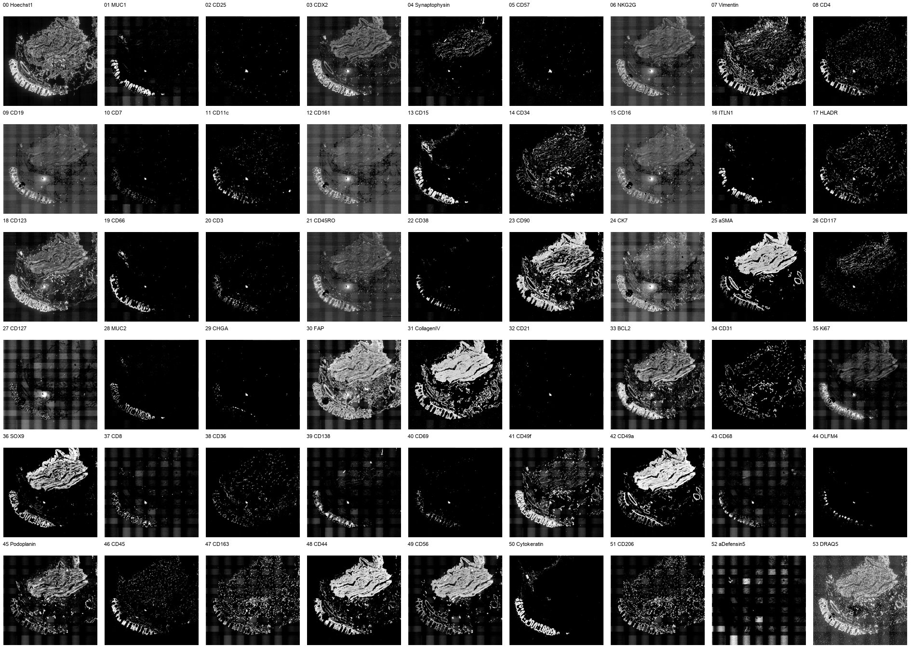
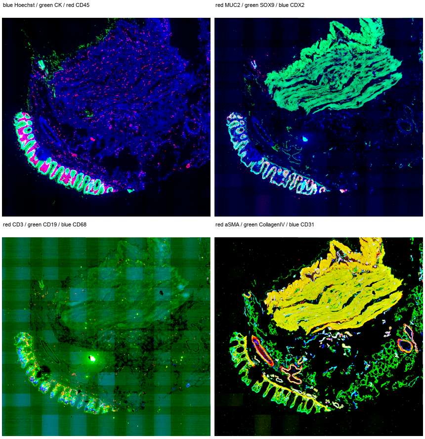
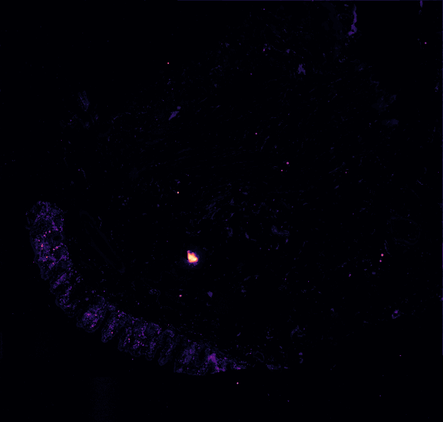
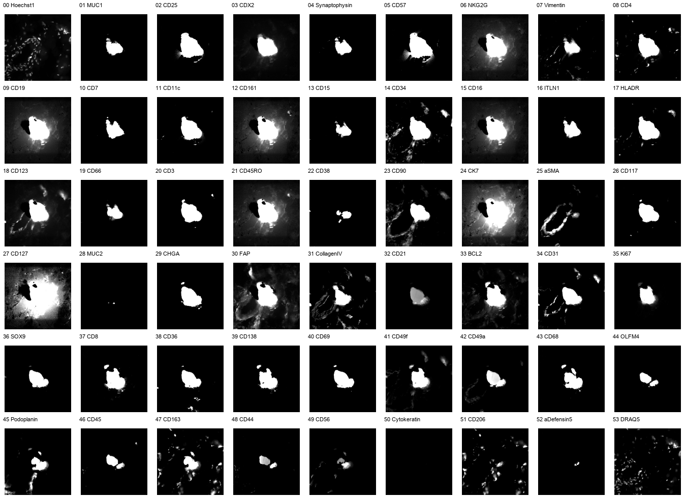
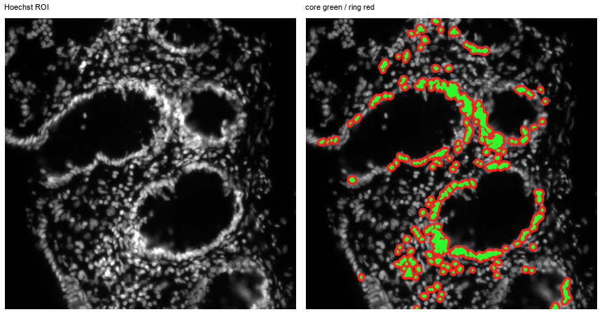

# Отчет по первичному QC и биологической проверке CODEX-датасета HuBMAP

Дата анализа: 2026-05-31  
Локальный файл: `data/reg001_expr.ome.tif`

## Источники и контекст

- HuBMAP dataset: <https://portal.hubmapconsortium.org/browse/dataset/a0946b9a99b0940c5e9eb7587deafee5>
- Статья: Elmentaite et al., *Organization of the human intestine at single-cell resolution*, Nature 2023: <https://www.nature.com/articles/s41586-023-05915-x>
- В статье указано, что CODEX-панель выбиралась для эпителия, стромы, врожденного и адаптивного иммунитета, а паттерны антител валидировали на ожидаемых IHC-паттернах и H&E-морфологии. Там же описано, что после обработки исключались клетки, положительные `(z > 1)` более чем по 35 флуоресцентным маркерам. Это напрямую относится к найденным здесь pan-marker пятнам.
- Документация HuBMAP/CODEX описывает, что processed microscopy data могут включать stitching, background subtraction, deconvolution, extended depth of field, shading correction и др.; для CODEX также ожидаются blank cycles/background subtraction.

## Данные

OME-TIFF содержит 54 канала, размер `9514 x 9990 px`, тип `uint16`, физический размер пикселя `377.4 nm`, поле зрения примерно `3.59 x 3.77 mm`.

Звездочкой отмечены 18 каналов, уже извлеченные и использованные в текущей работе:

- Nuclear / proliferation: `00 Hoechst1*`, `35 Ki67*`, `53 DRAQ5`
- Epithelial / mucin / endocrine: `01 MUC1`, `03 CDX2`, `04 Synaptophysin`, `16 ITLN1`, `19 CD66`, `24 CK7`, `28 MUC2*`, `29 CHGA`, `36 SOX9*`, `41 CD49f`, `42 CD49a`, `44 OLFM4`, `48 CD44`, `50 Cytokeratin*`, `52 aDefensin5`
- Immune: `02 CD25`, `05 CD57`, `06 NKG2G`, `08 CD4*`, `09 CD19*`, `10 CD7`, `11 CD11c`, `12 CD161`, `13 CD15`, `15 CD16`, `17 HLADR`, `18 CD123`, `20 CD3*`, `21 CD45RO*`, `22 CD38`, `26 CD117`, `27 CD127`, `32 CD21`, `33 BCL2`, `37 CD8*`, `39 CD138`, `40 CD69`, `43 CD68*`, `46 CD45*`, `47 CD163`, `49 CD56`, `51 CD206`
- Stromal / vascular / ECM: `07 Vimentin*`, `14 CD34`, `23 CD90`, `25 aSMA*`, `30 FAP*`, `31 CollagenIV*`, `34 CD31*`, `38 CD36`, `45 Podoplanin*`

Полная таблица: `channel_inventory.csv`.

## Что было сделано

1. Прочитаны все 54 страницы OME-TIFF.
2. Для каждого канала рассчитаны percentiles, mean/std, доля нулей, доля почти насыщенных пикселей.
3. Построен downsample `factor=16` для визуального QC и быстрых метрик.
4. Для каждого non-nuclear маркера построена бинарная карта top `0.5%` по интенсивности; затем посчитано, сколько non-nuclear маркеров одновременно яркие в каждом downsample-блоке.
5. Найдены connected components, где одновременно яркие >=15 non-nuclear маркеров.
6. Для Hoechst проверен локальный nuclear halo: ядро, кольцо вокруг ядра и дальний локальный фон.
7. Сохранены обзорные изображения и кропы подозрительных зон.

## Главные визуальные материалы

Все 54 канала, log stretch:

Биологические RGB-композиты:

Карта числа одновременно ярких non-nuclear маркеров:

Главная pan-marker зона, все 54 канала:

Hoechst halo ROI:

## Визуальные и технические артефакты

### 1. Горизонтальные и вертикальные полосы / tile grid

При log/high-contrast stretch видна регулярная горизонтально-вертикальная сетка. Она особенно заметна в низкоинтенсивных или разреженных каналах, например `MUC1`, `CDX2`, `NKG2G`, `CD19`, `CD16`, `CD45RO`, `CD127`, `SOX9`, `CD45`, `CD44`, `CD206`, `DRAQ5`, а также в части стромальных каналов.

Это выглядит как технический фон: stitching/shading/background subtraction/cycle-dependent background, а не как биология. В некоторых каналах биологический сигнал сильнее сетки (`Hoechst1`, `Cytokeratin`, `CollagenIV`, `aSMA`, `CD31`), но в слабых immune-маркерах сетка может заметно влиять на low-level signal и корреляции.

Файл с каналами, где профильная метрика полос была максимальной: `top_stripe_metric_channels.png`. Таблицы: `stripe_metrics.csv`, `stripe_metrics_v2_downsampled.csv`.

### 2. Повышенный фон вокруг ядер на Hoechst

В Hoechst ROI кольцо вокруг ярких ядер заметно светлее локального дальнего фона:

- median ядра/core: `28103`
- median ring вокруг ядра: `15759`
- median дальнего локального фона: `6031`
- ring / far local ratio: `2.61`
- ring / low-background ratio: `24.21`

То есть наблюдение про светлый фон вокруг ядер подтверждается. Это может быть комбинация out-of-focus light, deconvolution/PSF halo, локального background, частично overspill от плотной ядерной области. Для сегментации и single-cell quantification это не фатально, но raw mean intensity по маленьким маскам может быть завышен вокруг плотных скоплений ядер.

Таблица: `nuclear_halo_metrics.csv`.

### 3. Участки, где положительны почти все маркеры

Это самый важный артефакт.

Алгоритмически найдено 24 connected components, где одновременно яркие >=15 non-nuclear маркеров. Максимум: 49 из 52 non-nuclear маркеров в одном downsample-блоке.

Крупнейшая зона:

- component `19`
- центр примерно `y=5805 px`, `x=4331 px`
- площадь `187` downsample-блоков, около `6818 um^2`
- максимум `49` non-nuclear маркеров
- среднее по зоне `34.1` non-nuclear маркера
- nuclear-high fraction только `0.176`
- hit markers: 45 маркеров из разных взаимоисключающих групп

Эта зона яркая одновременно в T-cell, B-cell, macrophage, APC, epithelial transcription factor, stromal, vascular и ECM маркерах. Визуально это не похоже на клеточную структуру: нет нормальной ядерной морфологии, есть плотный яркий clump/пятно с темным/переэкспонированным участком и halo. Кроп `spot_019_all_54_markers.png` показывает, что сигнал повторяется в большом числе биологически несовместимых каналов.

Мелкие зоны `spot_008`, `spot_020`, `spot_032`, `spot_057` часто выглядят как точечные bright specks: несколько пиксельных/малых объектов, которые одновременно загораются в множестве иммунных, эпителиальных и стромальных маркеров, часто без Hoechst/DRAQ5-ядер.

Вывод: эти pan-marker пятна почти наверняка являются техническими/препарационными артефактами, а не биологически осмысленными клетками или тканевыми нишами. Наиболее вероятные варианты: autofluorescent debris, antibody aggregate/precipitate, тканевая складка/overlap, локальное загрязнение или материал с сильной неспецифической флуоресценцией. Это согласуется с самой статьей, где клетки, положительные более чем по 35 маркерам, удаляли из анализа.

Таблица: `multimarker_positive_components.csv`. Кропы: `multimarker_spot_crops/`.

## Биологическая консистентность по группам

В целом крупная биологическая организация выглядит правдоподобно:

- `Hoechst1` и `DRAQ5` согласованы по ядерным областям.
- `Cytokeratin`, `MUC2`, `CDX2`, `SOX9`, `OLFM4` дают ожидаемые эпителиальные/криптовые паттерны, особенно вдоль крипт и эпителиальной дуги.
- `aDefensin5` слабый/редкий, что скорее ожидаемо для large intestine, где Paneth-like сигнал не должен доминировать.
- `CollagenIV`, `aSMA`, `FAP`, `Vimentin`, `Podoplanin`, `CD31`, `CD34` дают структурные stromal/vascular/ECM-паттерны.
- `CD45`, `CD3`, `CD4`, `CD8`, `CD19`, `CD68`, `CD163`, `CD206`, `CD138`, `HLADR` дают в основном разреженные immune-паттерны в lamina propria/стромальных областях.
- Корреляции `CD163-CD206`, `Hoechst1-DRAQ5`, `CD4-CD45`, `aSMA-CollagenIV/CD49a` выглядят ожидаемо.

Но есть важные caveats:

- В некоторых слабых/разреженных маркерах сильный фоновый grid делает видимую картину похожей между биологически неродственными маркерами. Например, высокие downsample-корреляции `CDX2-NKG2G`, `CDX2-CD123`, `CD19-CD161/CD16` скорее отражают общий фон/артефакт, а не реальную коэкспрессию.
- Для `CDX2` и `SOX9` наряду с ожидаемым epithelial/nuclear signal виден широкий тканевый/стромальный background. Их лучше использовать после локальной коррекции фона и cell-level gating, а не как raw pixel intensity.
- Multi-marker spots нужно маскировать до любого clustering/UMAP/correlation, иначе они создают отдельный “pan-positive/noise” phenotype.

## Практические рекомендации

1. Маскировать pan-marker artifacts:
   - pixel/downsample rule: non-nuclear marker count >=15 по top 0.5% threshold;
   - cell-level rule в стиле статьи: клетки с `>35` маркерами `(z > 1)` исключать;
   - дополнительно требовать Hoechst/DRAQ5-подтверждение нормальной ядерной морфологии.

2. Для single-cell quantification не использовать raw mean без коррекции:
   - применять arcsinh/log transform;
   - нормализовать по маркерам;
   - вычитать локальный фон или blank-cycle background, если доступны исходные blank channels;
   - отдельно QC-flag для low-SNR каналов с выраженной сеткой.

3. Для слабых immune-маркеров интерпретировать только cell-associated puncta, совпадающие с ядерными масками и ожидаемой тканевой локализацией. Фоновая grid-текстура не должна попадать в positive calls.

4. Для текущей работы с 18 каналами:
   - `Hoechst1`, `Cytokeratin`, `CollagenIV`, `aSMA`, `CD31`, `Vimentin`, `CD45/CD3/CD4/CD8/CD19/CD68` в целом информативны;
   - `SOX9`, `FAP`, `Podoplanin`, `CD45RO` требуют осторожности из-за фоновой/структурной компоненты и возможного grid;
   - найденные pan-marker пятна обязательно исключить из ROI/segmentation/statistics.

## Файлы анализа

- `analyze_codex_markers.py` - полный проход по OME-TIFF, статистики, downsample.
- `postprocess_light.py` - построение QC-карт и кропов без тяжелого matplotlib.
- `channel_inventory.csv` - все каналы, категории, ожидания, использовался ли канал в работе.
- `channel_statistics.csv` - базовые статистики всех каналов.
- `multimarker_positive_components.csv` - таблица pan-marker components.
- `nuclear_halo_metrics.csv` - метрики Hoechst halo.
- `downsampled_log_marker_correlation.csv` - корреляции маркеров на downsample.
- `multimarker_spot_crops/` - кропы top suspicious regions.
